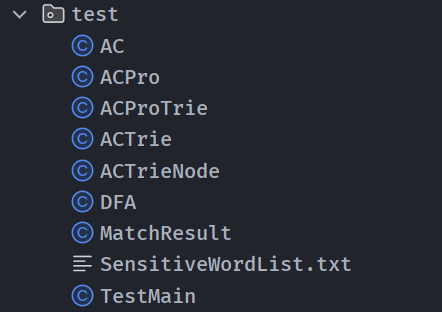
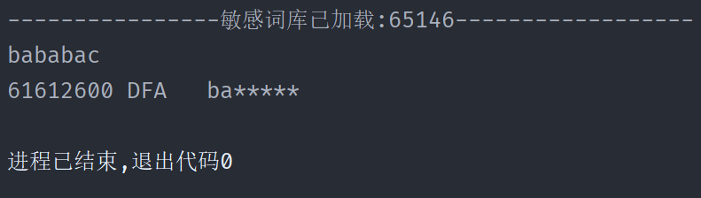
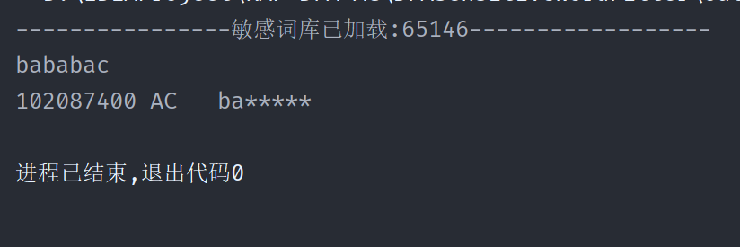
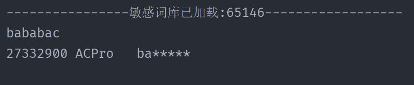
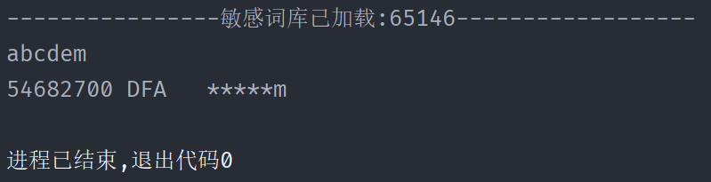
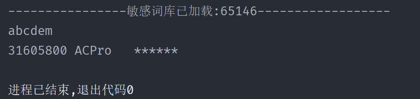
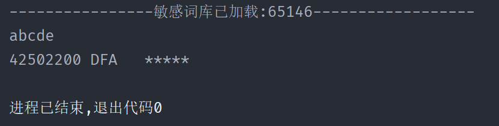
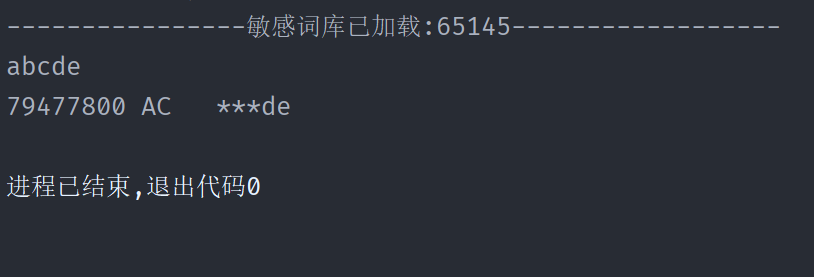
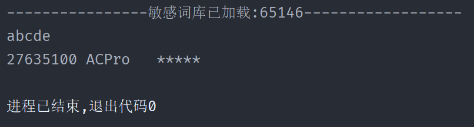

## 文件准备

自己写的是ACPro，AC是常规思路构建的，DFA是最基本的算法逻辑

自己ACPro主要优化的逻辑在：内部判断end节点后不是直接下定结论，而是去探测一下，去看看end是不是最终的，比如abcde和abc，其中c和e都是end，判断到c还会去探测到e，根据层高直接替换了，同时索引也直接变成e了，


验证代码在MainTest类中：

```java
public class TestMain {
    public static void main(String[] args) {
        DFA dfa=DFA.getInstance();
        AC ac=new AC();
        ACPro acPro=new ACPro();

        List<String> list = new ArrayList<>();
        try {
            BufferedReader in = new BufferedReader(new FileReader("SensitiveWordList.txt"));
            String str;
            while ((str = in.readLine()) != null) {
                list.add(str);
            }
        }catch (Exception e){
            System.out.println("----------------敏感词库加载失败------------------");
        }
        System.out.println("----------------敏感词库已加载:"+list.size()+"------------------");

        dfa.loadWord(list);
        ac.loadWord(list);
        acPro.loadWord(list);
        long start;
        long end;
        String test1="abcdefg";
        String result="";
        System.out.println(test1);
        start=System.nanoTime();
        for (int i = 0; i < 100000; i++) {
            result=acPro.filter(test1);
        }
        end=System.nanoTime();
        System.out.print((end-start));
        System.out.println(" ACPro   "+result);
//        start=System.nanoTime();
//        result=ac.filter(test1);
//        end=System.nanoTime();
//        System.out.print((end-start));
//        System.out.println(" AC   "+result);
//        start=System.nanoTime();
//        result=acPro.filter(test1);
//        end=System.nanoTime();
//        System.out.print((end-start));
//        System.out.println(" ACPro   "+result);
}
```

## 测试思路

刚开始是三个filter依次运行打印结果和时间并且是单次执行，但是发现执行顺序对结果影响较大，第一个运行的较慢，然后又先循环10次进行预热处理，后面再依次运行发现次序差异依旧很大，分析可能是因为热点代码的问题。最终决定单个执行，for循环10万次，输出总用时，每次保证敏感词相同，三个fiter都初始化，每次调用只改变for循环执行的filter，其他全部不变。

## 执行结果和截图

> 所有词库均隔离

1. 预设过滤敏感词：babac
   待匹配字符串： bababac

   耗时比：6：10：3

| filter | 时间 / 纳秒ns | 结果     | 次数    |
| ------ | ------------- | -------- | ------- |
| DFA    | 6161_2600     | 完全匹配 | 10_0000 |
| AC     | 10201_2600    | 完全匹配 | 10_0000 |
| ACPro  | 2733_2900     | 完全匹配 | 10_0000 |





2.预设过滤敏感词：abcde || dem 

  待匹配字符串： abcdem

  耗时比： 5：9：3

| filter | 时间 / 纳秒ns | 结果      | 次数    |
| ------ | ------------- | --------- | ------- |
| DFA    | 5468_2700     | m未被替换 | 10_0000 |
| AC     | 8845_8000     | 完全匹配  | 10_0000 |
| ACPro  | 3160_5800     | 完全匹配  | 10_0000 |





3.预设过滤敏感词：abcde || abc 

  待匹配字符串： abcde

  耗时比： 4：8：3

| filter | 时间 / 纳秒ns | 结果       | 次数    |
| ------ | ------------- | ---------- | ------- |
| DFA    | 4250_2200     | 完全匹配   | 10_0000 |
| AC     | 7947_7800     | de未被替换 | 10_0000 |
| ACPro  | 2763_5100     | 完全匹配   | 10_0000 |





## 总结

   将三组实两两对比不难得出下列结论：

   对于abcde|| dem这种首位嵌套的敏感词组，DFA方法只能匹配到abcde即"首"类型，而AC和ACPro均能全部判断出，并且这两种方法耗时都小于DFA，但ACPro方法明显耗时更短；
   对于abcde||abc这种具有包含关系的敏感词组，AC只能识别出最短的即abc，de无法过滤，但是ACPro和DFA均能全部判断，但ACPro方法明显耗时更短：

   ACPro匹配精度更高100%（可以看算法分析验证），而AC和DFA君会对特定场景局部失效；同时ACPro效率更高，性能提升2~3倍左右。
  （原来本地全是static方法，较快一点，匹配两个字的敏感词速度单次运行能夸张到1000多ns）

